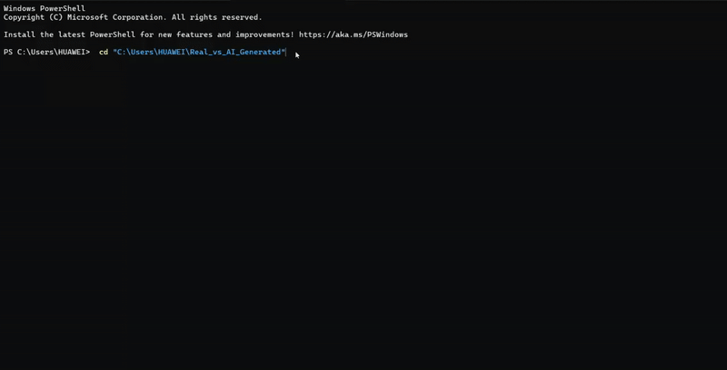
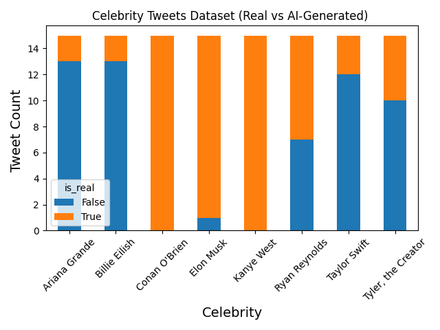
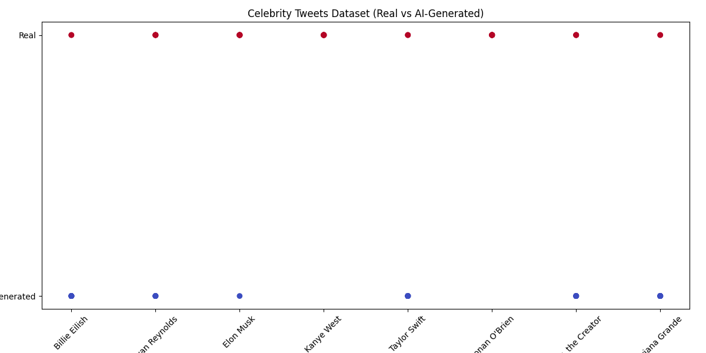
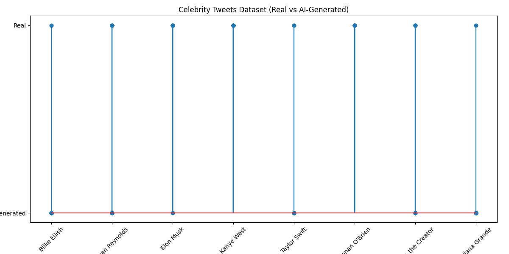

# Celebrity Tweets Visualization App

[](https://www.python.org/)
[](LICENSE)
[]()
[]()


A simple Python app that visualizes celebrity tweet data, comparing real tweets to AI-generated ones using charts. Built with `pandas` and `matplotlib`.

---

## Features

* Reads tweet data from a CSV file.
* Displays 3 types of visualizations:

  * **Bar Chart**
  * **Scatter Plot**
  * **Stem Plot**
* Error handling included (e.g., file not found).

---

## How to Run

1. Make sure you have Python 3.10 or higher.
2. Install required dependencies if needed.
```bash
git clone https://github.com/turki013/Real-vs-AI-Generated.git
```
3. Run the script:

```bash
python main.py
```

4. Follow the menu to choose a chart type.



---

## Chart Examples

### Bar Chart



### Scatter Plot



### Stem Plot



---

## Dataset Structure

The `tweets_dataset.csv` file should contain the following columns:

* `name`: The celebrity's name.
* `is_real`: A value (1 or 0) indicating if the tweet is real or AI-generated.

---

## Notes

* If the file is missing or corrupt, an appropriate error message will be shown.
* Each generated chart is saved as a `.png` file in the project directory.

